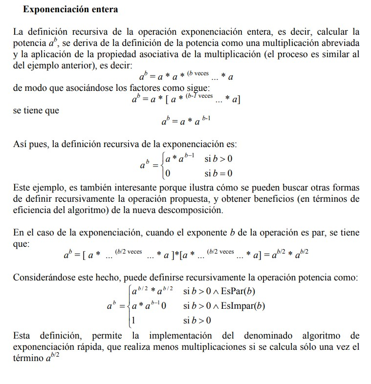
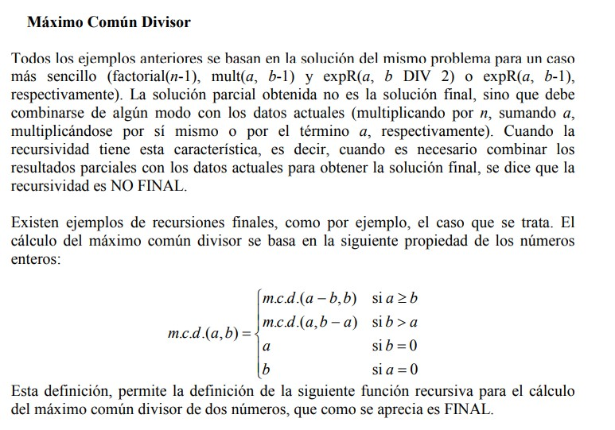

### Andres Ramirez 20161020077
### Samuel Holguin 20161020044
### Kevin Rocha    20161020086  

## *_Recursividad_*
### La recursividad es una técnica implementada en programación que nos permite que un bloque de instrucciones se ejecute un número de veces determinado, es un método que involucra volver a utilizar la función original

### aquí se observará la implementación de recursividad en diferentes ejemplos muy comunes como son: hallar la multiplicación entre dos números, el mínimo común múltiplo entre dos números y el cálculo de una potencia.

